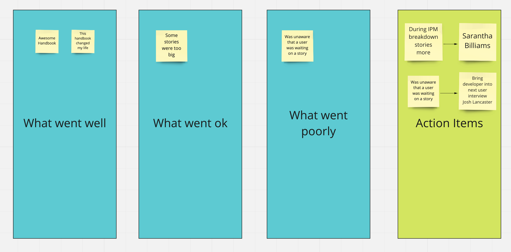
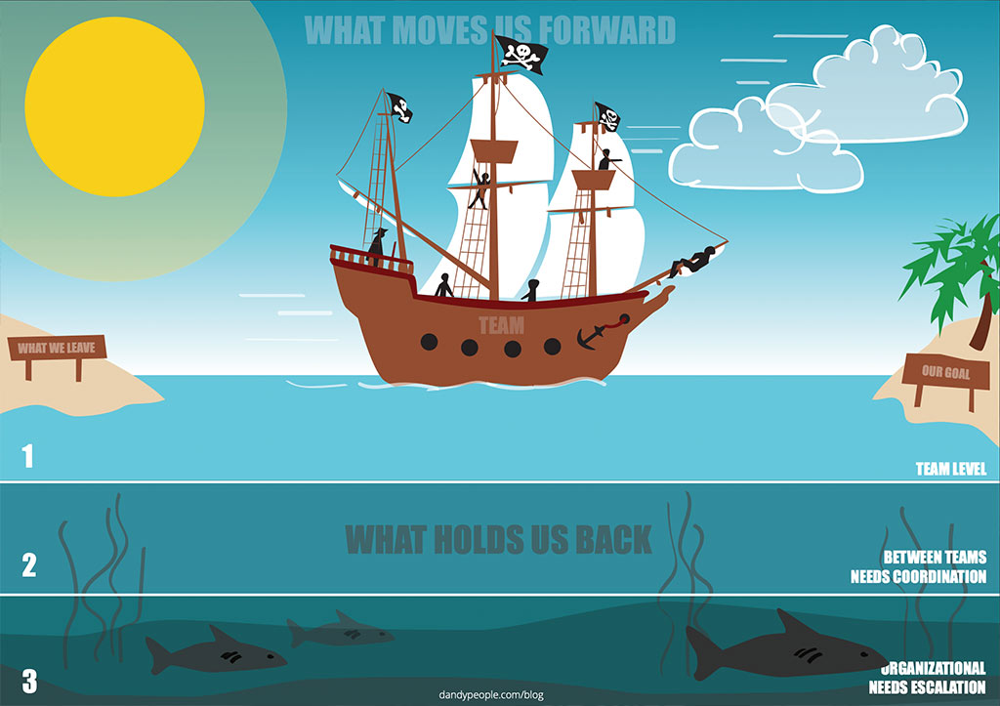

# Retro

**Who:** Entire development team, designer, PM  
**How Long:** 1 hour or less  
**Facilitator:** Rotate who runs the Retro. Also assign someone as the offline referee \(someone who offlines or cuts off a topic that is being talked about too long\)  
- As the facilitator you are looking to ensure every person speaks. Those who tend to be more reserved may not say anything unless given an opportunity or asked.  
**Tip:** Have each person put one thing up, and write it for them and then open the board up for everyone to write on as they please.  
**Goal:** Discuss what went well and what did not in a safe/controlled environment and create action items to mitigate them.  
**TIPS:**   
- If action items are made, but not followed retrospectives can quickly just turn into a platform to just complain. **Bring up Action Items during the daily standup until they are taken care of**  
- Everything from the working environment, communication between roles, technical decisions can be covered. This is a great time for the team to connect, it should be fun and productive. Bring snacks \(Since we are all remote, still bring snacks for yourself\) and enjoy the time as a team together.  
  
**2 Styles I like I find effective:**  
**1\) Classic good,ok/meh,bad with action items**  
I like this to be my typical retro, it is easy to understand and covers what went well, what could be improved and what did not go well.  
- To make it even simpler you can remove the ok/meh column and just have good and bad with action items

  
**2\) Sailboat or racecar**  
I like this to use this style of retro when a hypothesis has been delivered \(regardless of result\), and we take a more holistic view at the processes in place.  
  
PLACEHOLDER but I do love this visual for now:  
link: [https://dandypeople.com/blog/the-speedboat-retrospective-free-download-of-poster/](https://dandypeople.com/blog/the-speedboat-retrospective-free-download-of-poster/)  
  

