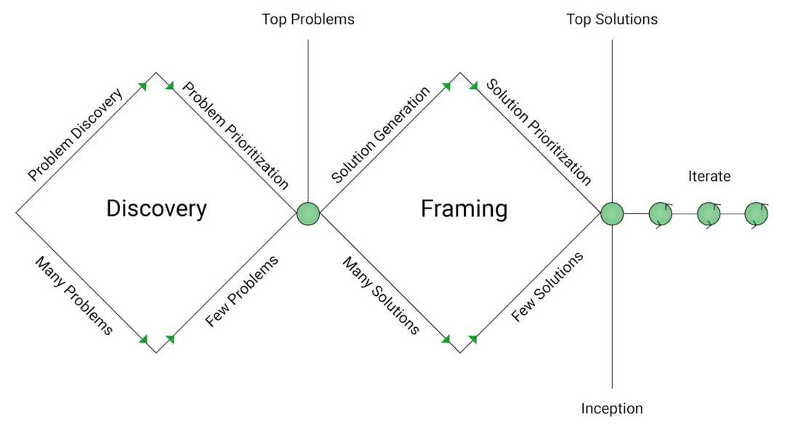

# Discovery and Framing

**What is Discovery and Framing:**  
You will hear some folks refer to this as DnF \(Discovery and Framing\), and this is the time when as a team identified in the scoping, you go wide and create a prioritized backlog of problems and a backlog of solutions. One of the keys here is to tackle and identify what you think is the high priority.   
  
**To say it another way, this is the time when you identify the following:**

* What problems you are trying to solve?  Pick the top one.
* What do people think about those identified problems? Interview your users
* What solutions do you have to mitigate or help with the problem? Pick the top one
* What do people think about the solution picked? Interview your users

**When do you have a Discovery and Framing?**  
This happens after a scoping, ensure that the team involved in Discovery and Framing understands at a high level why this potential problem is being tackled. Do not go into an [Inception](inception.md) with a Discovery and Framing first.   
  
**What do you need to run a Discovery and Framing?**  
**Who:** 1-2 developer\(s\), designer, PM for the product, stakeholder and a scoping facilitator  
**How long:** pair of weeks \(2,4 or sometimes 6\)  
  
**Goal:** Define the [hypothesis](hypothesis.md) for the product, and the potential solution you are going to test. Mock up any trial designs and get user feedback to test if we need to continue to persevere or pivot.  
**Approach:** This is dynamic to the product itself, however, a good starting point showing prototype and conducting interviews with potential users. If a system is already in place, journey map that out. For more ideas on how to do this read [The Lean Startup](http://theleanstartup.com/book)  
  
_Tip: As you interview users, keep track of users who are particularly interested as they will key for quick feedback. We call these folks early adopters._  
  
**Antigoal** \(What is Discovery and Framing not\): Go ahead on a solution without complete team and stakeholder synchronization or without identifying the problem  
  
  
**Diagram from Pivotal showing the process, move from left to right:**.  

