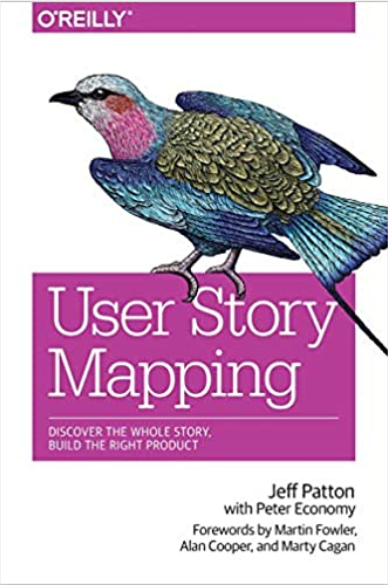
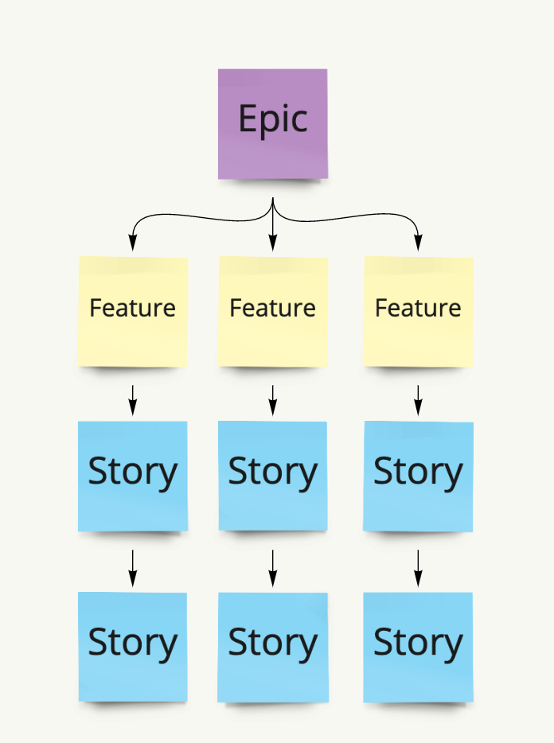

# Mapping

Stories, it is all about stories.

The product manager is similar to someone who is like a person trailer or a doctor of sorts. It is up to you to ensure the product is healthy, and following certain prescriptions in order to stay in tip top shape. Every product is different, and must be respected as such.

You are helping execute with the visionaries by:

Ensuring the work that is being done is iterative.

* At ANY point in the products life you can persevere or pivot
* pivot: to change direction or functionality being built out
* persevere: continue to iterate on the feedback you are receiving

Ensuring that the work is prioritized. Whether it is in it's infancy or developed, there will always be work/input for a product from users/stakeholders. This is not a good gauge of whether or not a product is of any value. Value is not based on how many folks are asking for something but rather off of a myriad of things\*

Stories, Features, Epics are all vague in the agile world but at Smarsh we are beginning to create an understanding of how they best for our teams.

Epic: A collection of features which thematically implement functionality

Feature: Slice of work with a shared goal, usually used as a label and stated in the title of a story

Stories: Small deliverable functionality which a user benefits from

\*See scoping  

