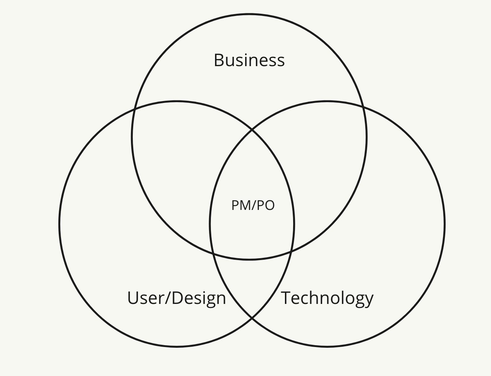

# What to Expect

**What to expect as a Product Manager**\
****You are responsible for maintaining a clear direction, conducting interviews for feedback, and being the ultimate communicator between the Business, User/Designer, and Team who are implementing the product. You are the leader of the product, and are making the best judgment you can, utilizing the knowledge you have received and gathered. You are also the blocker buster - if you see something that needs to be unblocked, you are equipped with the empowerment to have a conversation to do so.\
\
The Product Manager figures out what to build next and why. They do this by keeping in constant communication with the user and trying to pull out the most valuable information according to the business needs/goals, stakeholders' vision, and product goals so that a decision can be made quickly.\
\
As a Product Owner & Manager ensure that you are empowered to make decisions.\
\
_**Product Owner Domains of Work:**_\
\
**Domain Expertise**: More often than not your knowledge of the product and the market serves as a piviotal reason as to why you are valued in your company. The fact that you know a customer or how they use a product is the main reason you’re now a Product Owner.&#x20;

**Maximizing Product Value**: There are only so many hours until your product is released to customers. The Product Owner must focus on what is the most important "thing" to deliver next. This is a balancing act between resources, technical constraints, and the different products which add varying layers of business value.  An amazing Product Owner will learn through time how to best create balance & harmony with their team & company to maximize value streams & create a cohesive product portfolio in practice not just in principle.

**Communication and Influencing Skills**: Your soft skills in interpersonal relationships, communication & ability to work with many diverse individuals will be PARAMOUNT to your success as a Product Owner.  You will need to live by the phrases: 'Curiosity & Connection before Correction' & 'Clarity is Kindness' as one of your biggest domains is your ability to frequently engage in communication with others, listen carefully, and make sure others are on board with the next steps in getting the product completed.  You will want to be dynamic, adapt to various situations with ease, build rapport with a wide range of individuals & shift perspectives easily.  Their focus is on the technical aspects of the problem, your job is to communicate, facilitate understanding & drive clarity.

**Customer to Product to Developer Translator**: The Product Owner role lives in the gap between what customers want (or what they think they want), the creation of that idea with a team, and the delivery of a tangible product. You must be able to translate customer language into technical details.  Whether it’s sketches, Miro boards, sticky notes, conversations with intricate technical details or painting a picture of the product for your developers.  You make the difference in clarity each time as you drive understanding, asking more questions & reducing assumptions. \
&#x20;

**Where does a Product Manager fall?**

**Your backlog is the center of communication, ensure it is organized and ready to be talked about**

Take into consideration, ensuring stories are prioritized. You are also responsible for collecting the information you need, to ensure you have stories for the team to work on.

**You run the team meetings**

You are responsible for ensuring a Pre-IPM, IPM, Retro, Standup, and Demos are happening weekly. While some companies have this assigned to a Scrum Master, this is something we have intertwined with the role of the Product Manager ensuring communication is happening.\
\
**You conduct the interviews**\
****\
****You are responsible for getting specifications, thoughts, even capturing feelings when it comes to interactions with your product. Make sure you are meeting frequently and showing off what is being worked on weekly.\
\
**TO DO:**\
**1) Read all of this content within this handbook**\
**2) Read the Books suggested**\
**3) Meet with someone as a product mentor to use as a soundboard/mentor**\
**4) Start running a product of your own**\
\
_Tips:_\
_• When communicating regardless of medium, try not to use acronyms. You can never be sure of who might have valuable feedback but cannot cross the gap of understanding due to not realizing the context based on an undefined acronym._\
__\
_• This is not a sprint, this is a marathon - so ensure you have a healthy amount of rest and time spent outside of work to ensure you have a clear mind. The best Product Managers we have seen have an incredible work-life balance._
