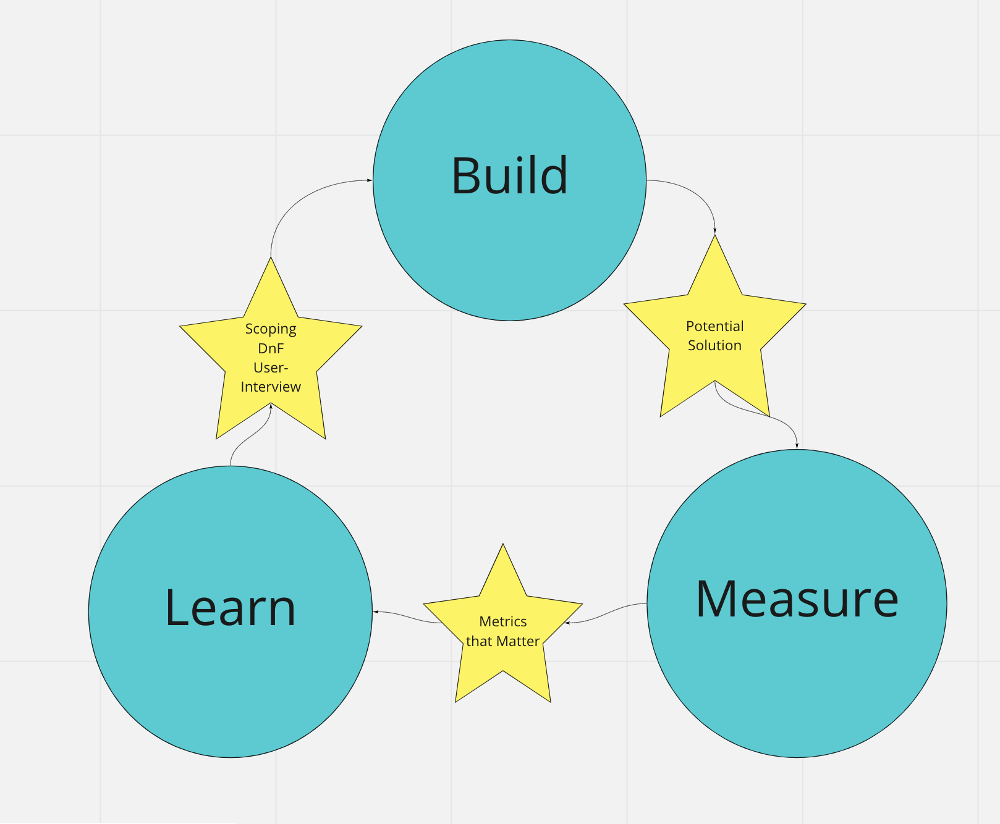
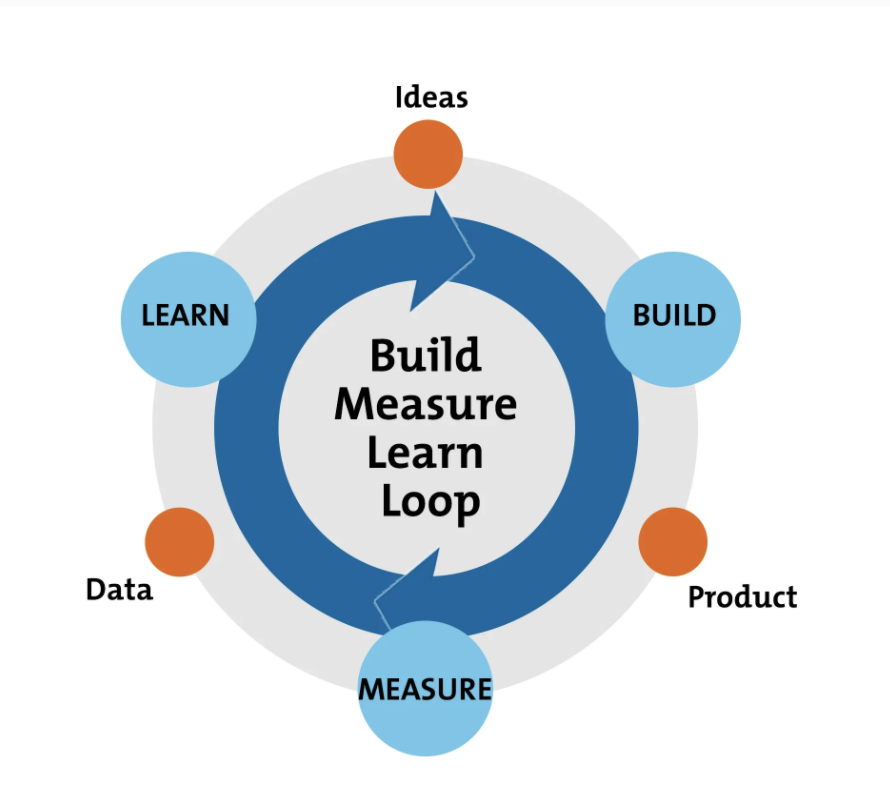

# High level understanding

First and foremost I highly recommend reading the book "The Lean Startup" by Eric Ries  
The following is a quick synopsis:  
**Key Points**

Eric Ries was the initial inventor the Build-Measure-Learn theory, in "The Lean Startup." He discusses a way of obtaining feedback about an idea or product or general and how to validate its is value in the current market. This style of development help reduce risk when delivering a solution, and helps you determine whether you are building the write thing or not quickly.

**The steps that make up the  Build-Measure-Learn feedback loop are the following:**

1\): **Plan** your hypothesis. We do this by scoping and Discovery and Framing  
2\): **Build** and Deliver an MVP \(Minimum Viable Product\) so that you can test it and start to collect feedback  
3\): **Measure** your metrics with the hypothesis created earlier  
4\): **Learn** from the metrics, and user feedback to determine if you need to persevere or pivot  
  
Once we have gone through all 4 steps, we can start at step one again

  
  
  
 ****   
  
****

  
**Cleaner graphic:**

